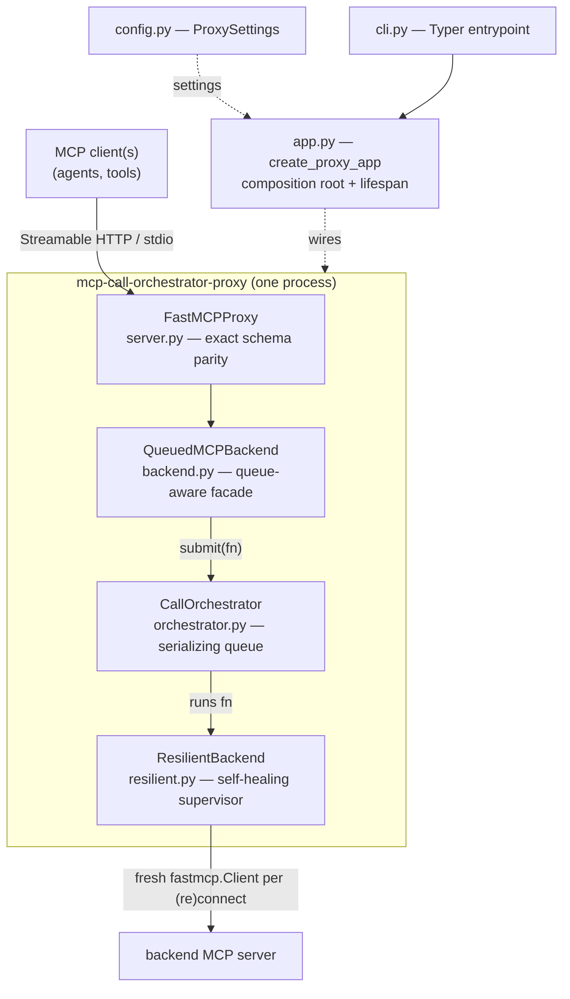

# Architecture

## Purpose / scope

The proxy makes a single, possibly-fragile backend MCP server safe for multiple
concurrent MCP clients. It does three things and nothing more:

1. **Session termination** — each client's MCP session terminates *at the proxy*. Clients
   never share a session with the backend, so one client cannot corrupt or race another's
   session state.
2. **Call serialization** — every operation forwarded to the backend passes through a
   single queue with a configurable concurrency limit (default `1` = fully serialized).
3. **Resilience** — the proxy stays connectable even when the backend is absent, and
   reconnects on its own when the backend comes and goes.

To the client it looks like the backend itself: the proxy mirrors the backend's tools,
resources, and prompts with their **exact original JSON schemas** (no lossy wrapper), plus
one added `backend_status` tool.

## Design invariants

These are load-bearing; changing any of them changes the product.

- **Exact tool/schema parity.** The proxy exposes the backend's tools/resources/prompts
  under their real names and schemas. Achieved by delegating to FastMCP's own
  `FastMCPProxy` rather than re-declaring tools. Nothing to hand-sync.
- **Exactly one backend.** A backend config that defines more than one server is rejected
  (`client.py::_single_server_transport`) — a composite mount would prefix every tool name
  (`{server}_{tool}`) and break parity.
- **Serialize by default.** `max_concurrent_calls` defaults to `1`. This is the whole
  reason the project exists; raising it is opt-in.
- **Stay connectable, degrade.** The proxy must start and remain connectable regardless of
  backend state. `initialize()` never raises when the backend is down (it returns the
  last-good or a synthetic result), so clients can always complete their handshake with the
  proxy. Discovery falls back to skipping a down backend rather than failing the listing.
- **Network-silent break detection.** The proxy never runs timed pings against the backend.
  A broken connection is signalled by a delegated call failing with a connection-type error
  (plus the client's own `is_connected()` when available). Reconnection-after-reappear is
  just the backoff retry loop — no polling.
- **Secrets stay out of code and out of `ProxySettings`.** Tokens come from the environment,
  a `.env` file, or the backend JSON (whose auth lives inside the built transport, never in
  the settings object), so a settings dump is safe to log.
- **A stdio backend's subprocess is fully owned by the proxy.** Started on connect, kept
  across reconnects, killed on break or shutdown — never left behind. FastMCP's
  `StdioTransport` defaults to `keep_alive=True` (meant for reusing one subprocess across
  several separate connections in a long-lived host process), which doesn't fit
  `ResilientBackend`'s shape: it builds a fresh client per (re)connect and drops the old one
  without an explicit close. Left at the default, that leaks the subprocess until Python
  happens to garbage-collect it. `client.py::_single_server_transport` forces
  `keep_alive=False` unconditionally — regardless of what a config's own `keep_alive` field
  says — so don't special-case or revert that override.
- **Severity carries meaning.** A record's level alone says whether the operator is needed:
  `WARNING`+ is reserved for the backend going away and coming back, `INFO` shows the queue
  working, `DEBUG` is for fault-finding. A degradation the proxy absorbs by design must never
  be logged like an unanticipated fault — if a self-healing reconnect looks the same as a real
  error, the level carries no information and gets ignored. See
  [Observability model](#observability-model).

## Component map & call flow

Every backend-facing call travels down this chain and back:

Key seam: every layer speaks the `MCPBackendClient` **Protocol**
([`interfaces.py`](src/mcp_call_orchestrator_proxy/interfaces.py)). Because `ResilientBackend`,
`QueuedMCPBackend`, the real `fastmcp.Client`, and the test doubles all satisfy it
structurally, they stack in any order with no adapters — which is what makes each layer
independently testable.

## Module responsibilities

| Module | Responsibility |
|---|---|
| [`cli.py`](src/mcp_call_orchestrator_proxy/cli.py) | Typer CLI (`run` subcommand). Maps flags to setting overrides, then runs the app over stdio or Streamable HTTP. CLI flags win over env vars. |
| [`config.py`](src/mcp_call_orchestrator_proxy/config.py) | `ProxySettings` (pydantic-settings, `MCP_PROXY_` prefix). Validates that a backend source is configured. |
| [`client.py`](src/mcp_call_orchestrator_proxy/client.py) | Builds the real `fastmcp.Client` from settings (JSON `mcpServers` file — HTTP/SSE **or** stdio (`command`/`args`) — **or** individual env vars, HTTP only). Enforces the single-backend invariant; forces `keep_alive=False` on a stdio transport; resolves a human-readable backend URL. |
| [`interfaces.py`](src/mcp_call_orchestrator_proxy/interfaces.py) | `MCPBackendClient` Protocol — the structural contract every layer implements. |
| [`resilient.py`](src/mcp_call_orchestrator_proxy/resilient.py) | `ResilientBackend` — owns the one live connection and a background supervisor that keeps it healthy across backend restarts. Sits *below* the orchestrator, so it never adds concurrency. Sources `backend_status`. |
| [`orchestrator.py`](src/mcp_call_orchestrator_proxy/orchestrator.py) | `CallOrchestrator` — MCP-agnostic queue. A single dispatcher pulls FIFO and runs each call as its own task, gated by a semaphore; each call is independently timed out so one hang can't wedge the queue. |
| [`backend.py`](src/mcp_call_orchestrator_proxy/backend.py) | `QueuedMCPBackend` — thin facade that routes every `MCPBackendClient` operation through `orchestrator.submit(...)`. Its `__aenter__/__aexit__` are no-ops (the real connection is opened once by the lifespan, not per call). |
| [`server.py`](src/mcp_call_orchestrator_proxy/server.py) | `build_proxy_server` — wraps the facade in `FastMCPProxy` directly (not `create_proxy()`) so the duck-typed facade is driven as-is with exact schemas. |
| [`app.py`](src/mcp_call_orchestrator_proxy/app.py) | Composition root. `create_proxy_app` wires settings → resilient → orchestrator → queued facade → proxy server, defines the lifespan, and registers the proxy-native `backend_status` tool. |

## Request lifecycle (a tool call)

1. A client calls a tool on the proxy over HTTP/stdio. `FastMCPProxy` (built with
   `provider_error_strategy="warn"`) receives it.
2. FastMCP opens `async with backend:` around the operation and calls `call_tool_mcp` on the
   `QueuedMCPBackend` facade. The facade's context manager is a no-op — the real connection
   is already open.
3. The facade wraps the call in a zero-arg coroutine and hands it to
   `CallOrchestrator.submit(...)`. The caller awaits a future.
4. The dispatcher pulls the call FIFO, acquires a concurrency slot (semaphore), and runs it
   as its own task under `call_timeout_seconds`.
5. The call reaches `ResilientBackend`, which delegates to the live `fastmcp.Client`. A
   successful `CallToolResult` (including `isError=True` *tool* failures) flows back up. A
   *connection* error instead marks the connection broken and raises
   `BackendUnavailableError`, which FastMCP maps to a clean MCP error for the client.
6. The result resolves the future; the slot is released; the next queued call proceeds.

## Resilience model

`ResilientBackend` runs a background **supervisor** task (started by the lifespan via
`async with resilient:`):

- **Connect → hold → break → back off → retry, forever.** On connect it records the
  init result and marks itself live. `_hold` keeps the connection until `_broken` or
  `_shutdown` fires, re-checking a local `is_connected()` each `backend_health_poll_seconds`
  (no backend traffic).
- **What counts as a break.** A delegated call that fails with a transport-level error
  (`_CONNECTION_ERRORS`), or with one of two `McpError` signals the SDK itself uses to mean
  "the session is gone, not just this call" (`_is_connection_broken_signal`), marks the
  connection broken and rebuilds it:
  - `CONNECTION_CLOSED` (code `-32000`) — the SDK's generic signal, synthesized by
    `BaseSession`'s receive loop for every pending request once its read stream ends, for
    *any* transport. This is what a stdio backend's dead subprocess produces (the pipe EOF is
    swallowed inside the SDK's own receive loop, so it never reaches us as a raw `anyio`
    error).
  - The exact *session-terminated* signal (code `32600` / message `"Session terminated"`) —
    the streamable-HTTP-specific clean HTTP 404 a backend returns for a now-unknown session
    id after it restarts with its listener still up.

  Both are broken-connection signals, not failed calls; an ordinary tool error
  (`CallToolResult(isError=True)`) or any other `McpError` is a per-call failure and leaves
  the connection live. The match is scoped to these exact codes precisely because an unknown
  or failed tool call also raises `McpError`, and treating the whole class as a break would
  tear the connection down on an ordinary error.
- **Bounded, jittered backoff.** Delay grows from `reconnect_initial_backoff_seconds` by
  `reconnect_backoff_multiplier` up to `reconnect_max_backoff_seconds`, with ±20% jitter so
  retries don't lock-step. It never hammers a down endpoint.
- **Fresh client per attempt.** Each (re)connect builds a new `fastmcp.Client` via the
  factory, sidestepping stale-session issues.
- **`initialize()` never raises when down.** FastMCP forwards `initialize` on every client
  connect; raising would stop agents from connecting to the *proxy* while the backend is
  down. It returns the last-good result, or a synthetic one before the first connect.
- **Prompt shutdown.** The backoff sleep is interruptible by the shutdown event, so
  `SIGTERM` mid-backoff tears down immediately instead of stalling systemd's stop timeout.
- **Supervisor never dies.** Unexpected exceptions are logged and retried, never propagated
  out of the supervisor loop.

`backend_status` (registered in `app.py`) exposes a snapshot of this state — `connected`,
`backend_url`, `last_connected_at`, `last_error`, `consecutive_failures`,
`current_backoff_seconds` — so a client can check availability without triggering a failing
call.

## Observability model

The log is the only window onto the thing this proxy exists to do — interleave several agents
safely against a backend that cannot take them at once. Three levels, each with a job
(`MCP_PROXY_LOG_LEVEL`, default `INFO`; user-facing detail in the README's **Logs** section):

| Level | Carries |
|---|---|
| `WARNING`+ | The backend went away; the backend came back. Nothing else. Quiet == healthy, so this level is what an alert rule watches. |
| `INFO` | Two records per call — one on acceptance (client, op, queue depth), one on completion (queue wait, backend exec). Arrival order vs. service order, which is the readable proof the queue works. A hang appears as an acceptance with no completion. |
| `DEBUG` | One extra record when a call actually starts running, which separates *waiting in the queue* from *at the backend, unanswered* — the two hangs that otherwise look identical. |

Two structural points, both load-bearing:

- **Client attribution lives in `backend.py`, not `orchestrator.py`.** Naming the calling
  client means reading MCP's request context, and the orchestrator is deliberately MCP-ignorant
  (it queues bare async callables). So the MCP-aware facade resolves the name and hands the
  queue an opaque `client=` string. The tag is a monotonic counter keyed on the session via a
  `WeakKeyDictionary` — **not** anything derived from `id()`, which CPython reuses once a
  disconnected client's session is collected, silently merging unrelated clients in the log.
- **What counts as "absorbed" is injected, not hard-coded.** `CallOrchestrator` takes an
  `expected_errors` tuple, logged at `WARNING` without a traceback; `app.py` passes
  `BackendUnavailableError`. The queue cannot know which failures its owner considers routine,
  and the composition root can — so the severity invariant above is enforced without the
  generic layer learning about backends.

## Configuration model

`ProxySettings` loads from env / `.env` (prefix `MCP_PROXY_`). Two mutually-exclusive
backend sources (see [`README.md`](README.md) for the full variable table):

- **JSON `mcpServers` config file** (`backend_config`) — the recommended route; the same
  format Claude Desktop / Cursor / Copilot use. Parsed/validated by FastMCP's `MCPConfig`;
  a single entry may describe an HTTP/SSE backend (URL + transport + auth) or a stdio one
  (`command`/`args`/`env`/`cwd`) transparently — FastMCP resolves either to its transport, no
  branching needed in this proxy beyond the `keep_alive` override above and the TLS `verify`
  kwarg only applying to HTTP/SSE. Wins when set.
- **Individual fields** (`backend_mcp_url` + `backend_api_key`) — the fallback, HTTP only; the
  API key is required in this mode.

TLS verification (`backend_verify_tls`, default `false`) is a separate knob in both modes,
because the standard `mcpServers` format has no verify field.

A stdio backend's environment is the `mcp` SDK's own doing, not this proxy's: `mcp.client.stdio`
merges a small safe allowlist (`PATH`, `HOME`, etc. — never the full parent environment) with
whatever `env` the config declares, so the child never sees the proxy's own environment or
secrets unless a config explicitly re-declares them.

`log_level` is validated to a `Literal` rather than parsed leniently: a silently-ignored
`--log-level VERBOSE` would leave an operator hunting for `DEBUG` records that were never
going to be emitted.
